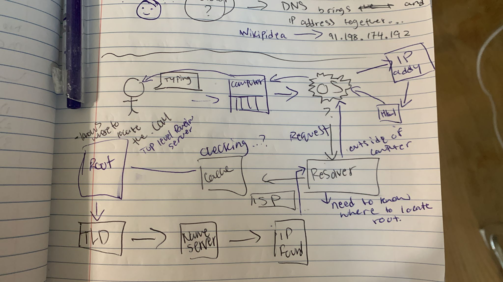

# 0x09. Web infrastructure design
## Concepts: 
  * Network basics
  * Server
  * Web server
  * DNS
  * Load balancer
  * Monitoring
  * What is a database
  * What’s the difference between a web server and an app server?
  * DNS record types
  * Single point of failure
  * How to avoid downtime when deploying new code
  * High availability cluster (active-active/active-passive)
  * What is HTTPS
  * What is a firewall

## Notes On Concepts

### **DNS**  
  * DNS is, in simple words, the technology that translates text-based domain names into machine-adapted numerical IPs 
  * When you type a websites name on your web browser, like "foobar.com”, the computer first searches in the **web browser DNS** cache if it knows what IP address “foobar.com” is.  Then if the web browser doesn’t know, it searches in the **Operating System** cache. If that also fails, the request for the IP address that belongs to “foobar.com” is sent to the resolver.
 * **The RESOLVER** is outside of your computer, the resolver checks on its cache to see if it knows the IP address for “foobar.com”, if it’s not on its cache it goes to the **“ROOT”.**
  *  All Resolvers must know how to **locate the root server**, this server knows how to find the ".COM", which is a TOP-LEVEL-DOMAIN(TLD).
  *  After the resolver visits the ROOT it stores the information of said request so it doesn’t have to do it again.
* Once it reaches the TLD for ".com" domains, if that specific TLD doesn’t know the answer, then it gives the resolver the name servers for that “foobar.com” website. The resolver stores the name servers for later. So it doesn’t need to do all of these requests all over again.
* Once the resolver reaches the name server, the Resolver finds its answer to which IP address corresponds to “foobar.com” because when you register a new domain, like “foobar.com” you have to manually register the name and communicate it to the TLD registry.

## DNS Drawing

## Monitoring

*"You cannot fix or improve what you cannot measure", You need to know how your application and your server is doing to know if there's something wrong.* 

### Web stack monitoring can be divided into two categories:
1. **Application monitoring**: which is getting data from your running application and making sure its behaving as intended

2. **Server monitoring**: Which is reading the data about your virtual or physical server and making sure they are not overloaded

>> 

### Some highly used monitoring tools:
**NewRelic,** this JavaScript based agent will collect information such as how quickly your website loads in a browser, which is a detailed analysis at every level of the stack. If your site is loading too slow or giving errors it will even alert you of this.

**DataDog**, allows you to measure everything with graphs, it gathers performance data from all of your application components. You can customize when DataDog will alert you.

**Uptime Robot**, a simple service that will check that your website is responding from multiple locations in the world. 

**Nagios**, Widely used but outdated.

**WaveFront**, cutting edge, tries to analyze anything that can produce a data point. It has a query language to manipulate and analyze the data. This and similar tools is what the top tier companies use internally.

## Web Server
Not to be confused with a server, a web server is a **software that delivers web pages**, and a server is an actual computer.

A web server is a piece of software that puts together all the pieces that make up a web page and sends them to your web browser.
Looks something like this:
	***Request ---> web server ---> renders the page in your browser***
>> 

  * **Request**: When you click enter in your URL “foobar.com” a request is sent to a machine that has a piece of software called web server
  * **Web server**: this software knows how to get the request, piece together the webpage and send it back to the browser that requested it.
  * **Browser**: Then the server gets the information back and proceeds to render it. An example of two commonly used web servers software are **Apache** and **NGINX**

## Network basics

### What is a protocol
A **protocol ** is a set of rules that both ends must have to share information over a network. Regardless of the devices underlying the infrastructure, as long as both parties have the same protocol they can communicate with each other.

In the OSI model, each layer has one or more network protocols governing the layer activities.
### What is an IP address
Is like the physical address of a home or business, an IP address provides an address for a device in a network so data can be sent from and to the device.

### What is TCP/IP
  * Is a suite of communication protocols that it’s used to interconnect devices on the internet.
  * It specifies how data is exchanged over the internet, breaks it into : packets, addressed, transmitted, routed and received at the destination.
  * It has two main protocols, TCP defines hows applications can create channels of communication across a network. It also manages how a message is assembled into smaller packets before they are transmitted over the internet and reassembled in the right order at the destination.
  * IP defines how to address and how to route each packet to make sure it reaches the right destination.
  * It also has other protocols to complete its functionality, like **subnet mask, NAT, HTTP, HTTPS and FTP.**
  * **HTTP** handles the communication between a web server and a browser

### What is an internet protocol IP port
PORT numbers allow different applications to share network resources on the same computer. They work like telephone extensions (510, 787...etc). 

Imagine that your computer is an office, Its number is 192.168.1.1 , but you want to reach the receptionist. To do that you need their extension, say :8080. So to reach the receptionist you dial 192.168.1.1:8080. 

At the same time someone else calls but need to talk to the boss, which is on the :433 extension, then you dial 192.168.1.1:433 and you are calling the boss directly. 

>> 

In networking terms is really similar but you need to know that TCP/IP and both TCP and UPD use a set of ports that work together with IP addresses. There are more than 60k ports between udp and tcp, and some of them are reserved for common applications as an standard, say HTTP which used port :80 or https which uses port :443

## what is a FIREWALL
>> 

  * It’s like a house dence that prevents hackers from penetrating your computer.
  >* Access a defense system for a local computer. That protects it from any attack. 
>>* Can be a software like a security program.
 >> * Or can be Hardware like a physical router
  >* Scan a packet of data. 
  >> * Packet of data: small chunk of a larger whole which  is reduced in size for easy transmission. 
  >> * Firewalls make sure those packages don’t have anything bad
  >>> * Common features are  login and reporting of attacks. Success or failure, slow down of traffic. 
  * A firewall is a network security device that monitors incoming and outgoing network traffic and controls the flow of traffic.
  > * Like a first line of defense
  * They establish a barrier between secured and controlled internal networks that can be trusted and untrusted outside networks, such as the Internet. 

## What is HTTPS
>> 

HyperText Transfer Protocol Secure (HTTPS) is the secure version of HTTP.  These are protocols that send data between the browser and the website  you’re connected to.  HTTPS, *‘s’ * at the end makes it secure and makes all the communication between browser and websites encrypted. Https is good for confidentially.  Like when you want to make a transaction..

>> 

** *The padlock means the website is secure.*** 
### How HTTPS works:
There are 2 secure protocols that hhtps usually use. SSL(secure Sockets Layer) or TLS(Transport Layer Security). Both protocols are known as asymmetric (PKI)Public key infrastructure systems, which use 2 keys to encrypt communications. Here is where a public key and private key come to play. Anything that is encrypted by a public key can only be accessed/decrypted by a private key and vice-versa. 

Private keys are private, which means that they should only be accessed by  its owner.  In websites private keys remain secure on the web server. The public key is open to anyone and everyone that needs to be able to decrypt information that was encrypted with the private key.

### Requesting https connection to a webpage:
1. Website sends request to it’s SSL certificate to your browser
> Certificate holds public key that's needed to begin secure session
2. Depending on the initial exchange, the website starts the SSL handshake.
> This involves generation of shared secrets, to establish a UNIQUE secure connection between user and the website.
>> 
>> 

### Benefits of Hypertext Transfer Protocol Secure
The major benefits of a HTTPS certificate are:
* Customer information, like credit card numbers, is encrypted and cannot be intercepted
* Visitors can verify you are a registered business and that you own the domain
* Customers are more likely to trust and complete purchases from sites that use HTTPS

>> 
## Load Balancer
A load balancer is a way to handle huge amounts of traffic by distributing the workload dynamically between servers. 

There are both types of load balancers; hardware and software. They offer a multitude of advantages and are basically a must for any operation that pretends to be scaled and have big growth. 

### Different load balancing algorithms
  * **Random**: this method randomly distributes the load across the available servers. 
  * **Round Robin**:  passes each new connection request to the next server in line, eventually distributing the load evenly between all servers.
  * **Weighted Round Robin (aka RATIO)**: Like round robin but with a twist, each machine gets request over time proportional to its computing capabilities, which you define by the ratio weight you give to each machine.
  * **Dynamic Round Robin (aka Dynamic Ratio)**: Like round robin but weights are based on continuous monitoring of the servers and therefore the weights/ratio are constantly changing.
  * **Fastest**: It passes a new connection based on the fastest response time of all available servers
  * **Least connections**: The system passes a new connection to the server with the least connections.
  * **Observed**: Is a combination of Fastest and Least connections. With this method available, servers are ranked based on a combination of the number of connections they are currently handling and how fast they are responding.
  * **Predictive**: Like Observed but taken to the next level. It tries to get ahead of the curve by analyzing the trend of ranking over time... determining whether a server performance is currently improving or declining.
>> 

## Servers
Servers are basically computers, or a collection of many computers over the network that are there to provide functionality or data for other programs or devices. They are normally at a place called “datacenter”

>> 

In the diagram above, you can see one server providing functionality to six computers over a network.

There are multiple types of servers like:
* DNS
* File servers
* Web Server
* Index/search
* proxy servers
* directory
* game servers. Etc.

## What is a database
A DATABASE Is information that  is set up for **easy access, management and updating. **They are used for storing, maintaining and accessing any sort of data.

## What is a database
A DATABASE Is information that  is set up for **easy access, management and updating. **They are used for storing, maintaining and accessing any sort of data.

## What is the difference between a web server and an app server
  * Web servers have no server side logic, they serve non-dynamic or static content.
  * They accept and fulfill requests from clients for static content, html pages, files, images, videos etc. Web server handle HTTP request only
  
  * APP servers have server side logic that interact with the database, they respond with dynamic content.. 
  * They expose business logic to the clients which generates dynamic content. It is a framework that transforms data to provide the specialized functionality offered by a business, service, or application. Application servers enhance the interactive parts of a website that can appear differently depending on the context of the request

|   WEB SERVER  | APP SERVER  |
| ------- | ------------ |
| Delivers Static Content | Delivers dynamic content |
| Content is delivered using the HTTP protocol | Provides business logic to the application programs using several protocols, including HTTP |
| Servers only web-based applications | Server web and enterprise-based application |
| No support for multi-threading | Uses multi-threading to support multiple request in parallel |
| Facilitates web traffic that is not very resource intensive | Facilitates longer running processes that are very resource-intensive |
